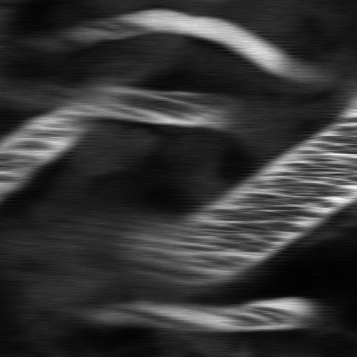

# FLICS Upgrade
## Python course final project, 2018
### Zvi Baratz, Amit Koren and Omer Granoviter

In our lab (Pablo Blinder's), we study the neurovascular response in mice _in vivo_. To that end, we need to measure blood flow, and changes in it, during imaging sessions. Up till recently, measuring blood flow required illuminating and scanning the mouse’s brain in a very specific pattern. This method works and has been validated on multiple occasions, but it very much limits the amount of information one can extract from these imaging sessions **besides** blood flow. 

In 2014 an Italian group published [this paper](https://www.nature.com/articles/srep07341), introducing a new method to measure blood flow from standard imaging sessions. Its input is a time lapse movie containing stained vasculature, and the regions of interest with vessels you wish to measure. A few other parameters, like the frame rate of the movie, are also required. Its output is the blood flow rate over time in each region of interest. Recently we received the original code used in the article, with purpose in mind to use it for our own research, but unfortunately it’s absolutely horrifying. The code is extremely low quality, written in a very unclear manner with zero thought of performance and reusability.

Assuming the code is doing its job, albeit poorly, we want students in our lab to use this algorithm to calculate blood flow without writing more code. To that end we've written a GUI into which you load an existing time lapse movie of a recording you've made, enabling you to choose the regions of interest in that image, then passing it to the algorithm and finally displaying the result. This GUI is already written and working, but we'd like it further polished, especially in the back-end side of things - saving the results of the analysis is currently improperly handled, and we'd like to fix that.

## Tasks overview
The first thing you should do is read the paper. It's technical, but don't let the equations fool you, the actual implementation is much simpler (perhaps even alarmingly simple). Then you should all be able to run the basic code, located in the `flics` subdirectory, and receive similar results to the ones shown in the `review_box.docx` file. Finally, try running the GUI code named `XXX.py`. The GUI was written with PyQT and should be pretty simple to run and edit.

## Subgroups division
### Code upgrade - Zvi
The code is found in the `flics` directory. The first thing to do is to run it and verify that the results are similar to the ones in the article. Save these results and regard them as your "ground truth", since after you start refactoring you'll have to double check that you haven't changed the actual alogrithm. 

Then starts the actual refactoring process. I trust in you to make wise decisions during your work, so I'll leave out the specific details on what exactly should be changed. Also, the code is in such bad shape that _any_ change you make will probably be a good one.

### GUI upgrade - Omer and Amit 
The actual application is ran using a PyQT GUI, written by project students from our lab. The GUI needs to handle both inputs and outputs - and you'll find it's already doing a decent job (it wasn't written by Italians). The main quirk is the way we save and load data. The data format should be general enough to be read from other programs, so `.csv` is good, but `pickle` is not. Another important task is the documentation of the entire software - how to install, how to run, what do the parameters mean, etc.
